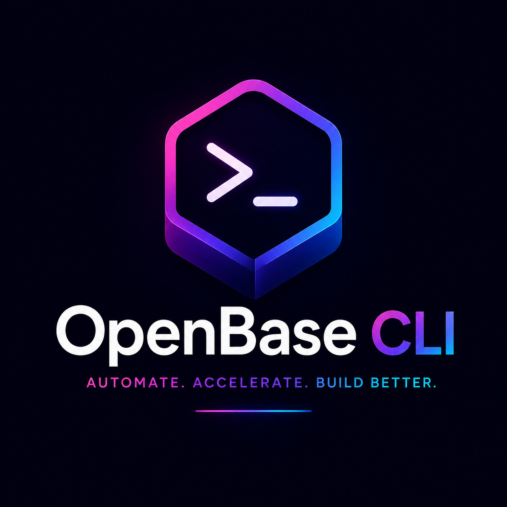

# OpenBase CLI

<p align="center">
  
</p>

The official command-line interface for the **OpenBase** ecosystem.

---

## Installation

Distributed as a .NET global tool:

```bash
dotnet tool install -g w3ti.OpenBase.Cli
```

To update:

```bash
dotnet tool update -g w3ti.OpenBase.Cli
```

---

## Usage

### 1. Build the project

```bash
openbase build
```

Runs `dotnet restore → dotnet build → dotnet test` in sequence, stopping immediately on the first failure.

| Flag | Description | Default |
|------|-------------|---------|
| `--configuration` | `Debug` or `Release` | `Debug` |
| `--no-restore` | Skip `dotnet restore` | `false` |

The command automatically detects the nearest `.sln` file (or `.csproj` if no solution is found).

---

### 2. Run the project

```bash
openbase run
```

Runs `dotnet restore → dotnet build` (without tests), starts the `Presentation.Api` project with live console output, and automatically opens the browser at the Swagger UI after 5 seconds.

The Swagger URL is read from `Properties/launchSettings.json` (prefers HTTPS). Fallback: `https://localhost:5001/swagger`.

| Flag | Description | Default |
|------|-------------|---------|
| `--configuration` | `Debug` or `Release` | `Debug` |
| `--no-build` | Skip restore + build | `false` |

Press `Ctrl+C` to stop the application.

---

### 3. Install the templates

```bash
openbase install
```

### 4. Create a new project

```bash
# SQL Server
openbase new --type api --template sqlserver --name MyProject

# PostgreSQL
openbase new --type api --template pgsql --name MyProject
```

The wizard will prompt for project configuration:

```
Project configuration

MediatR license (leave blank if you don't have one): <your-license>
AutoMapper license (leave blank if you don't have one): <your-license>
Database server [.]: .
Database user:
Database password:
```

The settings are automatically written to the `appsettings.json` and `appsettings.Development.json` files of the generated project.

### 5. Scaffold an entity

From the root of the created project:

```bash
openbase scaffold --entity Product
```

The command automatically detects whether the project uses **SQL Server** or **PostgreSQL** and opens an interactive wizard to define the entity's properties:

```
Entity properties
Database: SqlServer | Available types: int, long, short, string, bool, decimal, ...

Prop 1 — Name (PascalCase): Name
  Type: string
  Not null (required)? [y/n] (y): y
  + Name (string)

Add another property? [y/n] (n): y

Prop 2 — Name (PascalCase): Price
  Type: decimal
  Not null (required)? [y/n] (y): y
  + Price (decimal)

Add another property? [y/n] (n): n

┌────────────┬─────────┬────┬──────────┐
│ Property   │ Type    │ PK │ Not Null │
├────────────┼─────────┼────┼──────────┤
│ Id         │ int     │ ✓  │ ✓        │
│ Name       │ string  │ -  │ ✓        │
│ Price      │ decimal │ -  │ ✓        │
└────────────┴─────────┴────┴──────────┘
```

At the end, **47 files** are generated covering all Clean Architecture layers, and the entity's `DbSet` is **automatically injected** into `OneBaseDataBaseContext`:

| Layer          | What is generated                                             |
|----------------|---------------------------------------------------------------|
| Domain         | Entity, IRepository, IDomainService, DomainService            |
| Application    | DTOs, Commands/Queries, Handlers, Validators, Mapper, Service |
| Infrastructure | EF Core Configuration, Repository                             |
| Presentation   | Controller with full CRUD endpoints                           |
| Tests          | Unit tests for handlers, validators and services              |

#### Available property types

| Type            | SQL Server | PostgreSQL |
|-----------------|:----------:|:----------:|
| `int`           | ✓          | ✓          |
| `long`          | ✓          | ✓          |
| `short`         | ✓          | ✓          |
| `string`        | ✓          | ✓          |
| `bool`          | ✓          | ✓          |
| `decimal`       | ✓          | ✓          |
| `float`         | ✓          | ✓          |
| `double`        | ✓          | ✓          |
| `DateTime`      | ✓          | ✓          |
| `DateOnly`      | ✓          | ✓          |
| `TimeOnly`      | ✓          | ✓          |
| `DateTimeOffset`| ✓          | ✓          |
| `Guid`          | ✓          | ✓          |
| `byte[]`        | ✓          | ✓          |
| `JsonDocument`  |            | ✓          |

#### Validation rules auto-generated in Validators

- `string` required → `NotEmpty().MinimumLength(1).MaximumLength(255)`
- `Guid` required → `NotEmpty()`
- String fields on Update → rule with `.When(x => !string.IsNullOrWhiteSpace(x.Prop))`

#### Next steps after scaffold

The `DbSet` is automatically injected into `OneBaseDataBaseContext.cs`. Just run the migrations:

```bash
dotnet ef migrations add AddProduct
dotnet ef database update
```

---

### 6. Add an extension

Extensions add cross-cutting capabilities to an existing OpenBase project. Run from the solution root:

```bash
openbase extension add <name>
openbase extension add <name> --provider <provider>
```

The command:
1. Detects the project structure automatically
2. Adds the required NuGet packages to the relevant `.csproj` files
3. Generates the source files in the correct Clean Architecture layers
4. Injects configuration into `appsettings.json` where applicable
5. Injects the required middleware calls into `Program.cs` automatically
6. Registers the extension in `.openbase/extensions.json` to prevent duplicate installs

#### Available extensions

| Extension      | Command                               | Description                            |
|----------------|---------------------------------------|----------------------------------------|
| `jwt`          | `openbase extension add jwt`          | JWT Bearer authentication              |
| `healthchecks` | `openbase extension add healthchecks` | Health Checks with UI dashboard        |
| `redis`        | `openbase extension add redis`        | Distributed cache with Redis           |

#### `jwt` — JWT Authentication

```bash
openbase extension add jwt
```

Generates:

| File                                               | Layer          | Description                                      |
|----------------------------------------------------|----------------|--------------------------------------------------|
| `Application/Interfaces/Services/ITokenService.cs` | Application    | Interface for token generation                   |
| `Infra.Data/Services/TokenService.cs`              | Infrastructure | Implementation using `JwtSecurityTokenHandler`   |
| `Presentation.Api/Extensions/JwtExtensions.cs`     | Presentation   | `AddJwtAuthentication` extension method          |

Also automatically:

- Injects the `Jwt` section into `appsettings.json`:

```json
"Jwt": {
  "Secret": "CHANGE-ME-USE-AT-LEAST-32-CHARS-SECRET",
  "Issuer": "YourNamespace",
  "Audience": "YourNamespace",
  "ExpirationMinutes": 60
}
```

- Injects the required middleware into `Program.cs`:

```csharp
builder.Services.AddJwtAuthentication(builder.Configuration);
// ...
app.UseAuthentication();
app.UseAuthorization();
```

- Adds `[Authorize]` to all existing controllers in the project.
- New controllers generated with `openbase scaffold` are automatically created with `[Authorize]` when the JWT extension is installed.

> **After installation**, update the `Jwt:Secret` in `appsettings.json` with a strong secret (at least 32 characters).

#### `healthchecks` — Health Checks

```bash
openbase extension add healthchecks
```

Automatically detects installed services and adds the corresponding checks:

| Detected service | How it's detected                              | Package added                              |
|------------------|------------------------------------------------|--------------------------------------------|
| SQL Server       | `Microsoft.EntityFrameworkCore.SqlServer` in `Infra.Data.csproj` | `AspNetCore.HealthChecks.SqlServer` |
| PostgreSQL       | `Npgsql.EntityFrameworkCore` in `Infra.Data.csproj`              | `AspNetCore.HealthChecks.NpgSql`    |
| Redis            | `redis` extension installed via registry       | `AspNetCore.HealthChecks.Redis`            |
| RabbitMQ         | `rabbitmq` extension installed via registry    | `AspNetCore.HealthChecks.RabbitMQ`         |

Generates:

| File                                                        | Layer        | Description                                           |
|-------------------------------------------------------------|--------------|-------------------------------------------------------|
| `Presentation.Api/Extensions/HealthChecksExtensions.cs`     | Presentation | `AddOpenBaseHealthChecks` and `MapOpenBaseHealthChecks` extension methods |

Also automatically injects into `Program.cs`:

```csharp
builder.Services.AddOpenBaseHealthChecks(builder.Configuration);
// ...
app.MapOpenBaseHealthChecks();
```

Exposes three endpoints:

| Endpoint      | Description                                      |
|---------------|--------------------------------------------------|
| `/health`     | Full health report (JSON, compatible with UI)    |
| `/health/ready` | Only checks tagged as `ready`                  |
| `/health-ui`  | Visual dashboard (HealthChecks UI)               |

#### `redis` — Redis Cache

```bash
openbase extension add redis
```

Generates:

| File                                                        | Layer          | Description                                       |
|-------------------------------------------------------------|----------------|---------------------------------------------------|
| `Application/Interfaces/Services/ICacheService.cs`          | Application    | Interface with `GetAsync`, `SetAsync`, `RemoveAsync`, `ExistsAsync` (with TTL support) |
| `Infra.Data/Services/RedisCacheService.cs`                  | Infrastructure | Implementation via `IDistributedCache`            |
| `Presentation.Api/Extensions/RedisExtensions.cs`            | Presentation   | `AddRedisCache` extension method                  |

Also automatically:

- Adds the `Microsoft.Extensions.Caching.StackExchangeRedis` NuGet package
- Injects the `Redis` section into `appsettings.json`:

```json
"Redis": {
  "ConnectionString": "localhost:6379",
  "InstanceName": "openbase_"
}
```

- Injects the required call into `Program.cs`:

```csharp
builder.Services.AddRedisCache(builder.Configuration);
```

> **After installation**, update the `Redis:ConnectionString` in `appsettings.json` to point to your Redis instance.

> **HealthChecks integration**: if both extensions are installed, `openbase extension add healthchecks` automatically adds the Redis health check (`AspNetCore.HealthChecks.Redis`).

---

## Available commands

| Command                  | Description                                              | Example                                                        |
|--------------------------|----------------------------------------------------------|----------------------------------------------------------------|
| `build`                  | Restores, builds and tests the project (fail-fast)       | `openbase build`                                               |
| `run`                    | Builds and runs the project, opening Swagger in browser  | `openbase run`                                                 |
| `install`                | Installs the required NuGet templates                    | `openbase install`                                             |
| `new`                    | Creates a new project from the templates                 | `openbase new --type api --template sqlserver --name X`        |
| `scaffold`               | Generates all layers for an entity (interactive)         | `openbase scaffold --entity Product`                           |
| `extension add`          | Adds an installable extension to the project             | `openbase extension add jwt`                                   |
| `update`                 | Updates the CLI and templates to the latest version      | `openbase update`                                              |
| `history`                | Shows the update history per component                   | `openbase history --type cli`                                  |
| `version show`           | Shows the installed CLI and template versions            | `openbase version show`                                        |
| `version restore`        | Restores a component to a specific version               | `openbase version restore 10.5.9 --type cli`                   |
| `help`                   | Full guide to arguments and flags                        | `openbase help`                                                |

### Update history

```bash
# Show full history
openbase history

# Filter by component
openbase history --type cli
openbase history --type sqlserver
openbase history --type postgres
```

### Restore a version

Restores a component to a specific version. Useful to roll back a problematic update.

```bash
# Restore the CLI to a previous version
openbase version restore 10.5.9 --type cli

# Restore a template
openbase version restore 2.0.0 --type sqlserver
openbase version restore 1.5.3 --type postgres
```

The `--type` argument is required and accepts:

| Value       | Component                               |
|-------------|----------------------------------------|
| `cli`       | OpenBase CLI (`w3ti.OpenBase.CLI`)     |
| `sqlserver` | SQL Server Template                    |
| `postgres`  | PostgreSQL Template                    |

---

## Requirements

- .NET SDK 10 or higher

---

## Security & compatibility

- **Cross-platform**: Windows, macOS (Intel/Apple Silicon) and Linux
- **Security**: Process execution protected against command injection (S4036 compliance)
- Monitored by **SonarCloud**

---

## Contributing

See [CONTRIBUTING.md](CONTRIBUTING.md) for the branch naming conventions, commit message format, and pull request workflow.

---

## License

Distributed under the MIT License. See `LICENSE.txt` for more information.

Developed by Rodrigo Brito <rodrigo@w3ti.com.br>.
